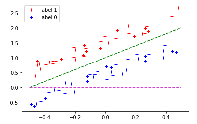
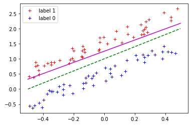
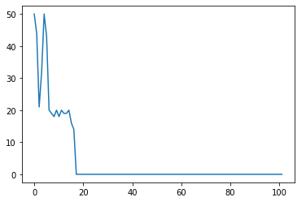

# PW01 - Perceptron
* Romain Capocasale
* Jean Demeusy
* T-DeLearn
* 28.02.2021

## Review
* Best params : y = 2x + 1
    * Weights : -2, 1
    * Bias : -1
* Obtained params : y = y = 1.85x + 1.25
    * Weights : -72.36, 39.17
    * Bias

Initial plot : 

Final plot : 

Learning curve : 

We can see that the number of epochs has been reduced to 100. The algorithm converges quickly enough to use 100 epochs. We can see that the algorithm converges around after epoch 20 and no more classification errors are made.
