# T-DeLearn PW02 - Exercise 3
* Capocasale Romain
* Demeusy Jean
* 06.03.2021

## D - Analyse the dependency of the final error rate on the number of epochs. What is the goal of the learning and how many epochs make sense ?
50 epochs
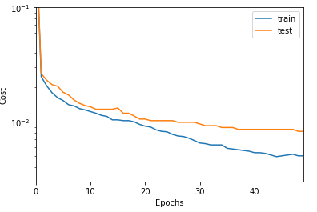

100 epochs
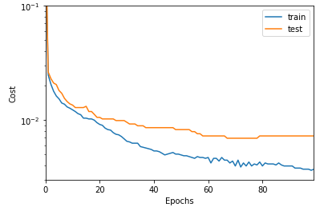

500 epochs
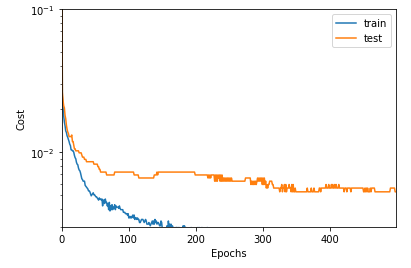

We can see that the error on the test set drops to 0 just before the 200 epochs. For the test error we can see that it stops decreasing also around 200 epochs. 200 epochs seems to be a good choice.

## E - Analyse the dependency on the learning rate by trying different values, Describe what you observe. How large can you choose the learning rate until the learning breaks down ?

alpha=0.01
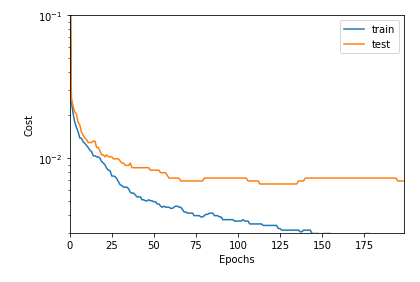

alpha=0.05
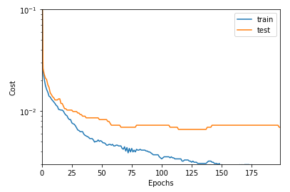

alpha=0.1
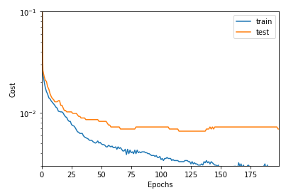

alpha=1
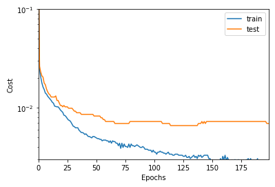

alpha=5
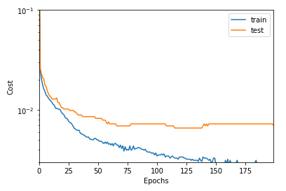

alpha=10
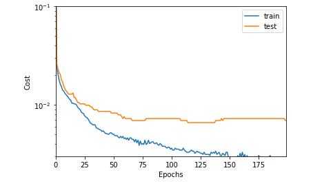

We can see that learning rates greater than 0.05 are slightly more difficult to converge to 0.

## F - Plot a histogram of the weights finnaly obtained from learing. A strong peak at zero remains. Why ? You may understad this when plotting the weights as an image. 

Weights Histogramms
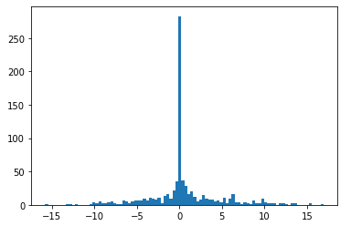

Weights Image
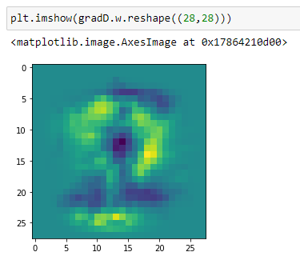

We can see that the many 0 come from the black background on the backgrounf around the numbers.

## F - Also compare this image with the misclassifed test images. Try to explain

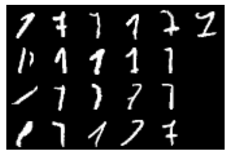

We can see that most of the errors come from numbers that even a human would not be able to classify between a 1 and a 7. Typically the image on the second line of the first column is very hard to classify. 