# T-DeLearn - PW03
* Capocasale Romain
* Demeusy Jean
* 13.03.2021

## Exercise 1
### Learning rate variation [batch_size=256,epochs=100]
* learning rate = 0.05
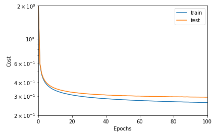
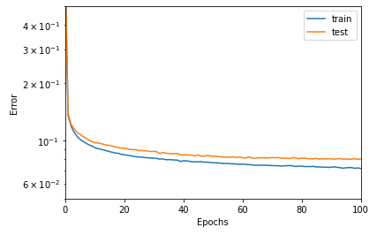

* learning rate = 0.1
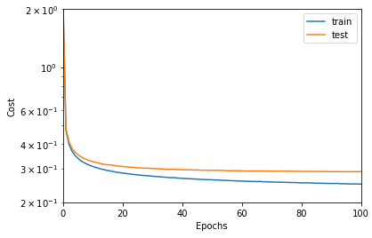
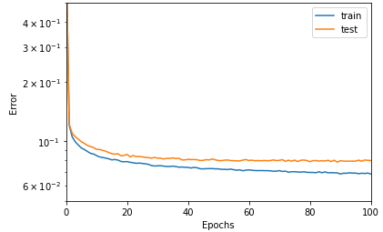

* learning rate = 0.5
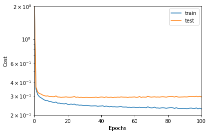
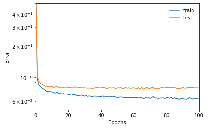

We see that the model with a learning rate of 0.5 seems to converge faster and better than the others.

The higher the learning rate, the more the curve oscillates as opposed to the curve with a low learning rate.

### Epochs variation [learning_rate=0.5, batch_size=256]
* Epochs = 50
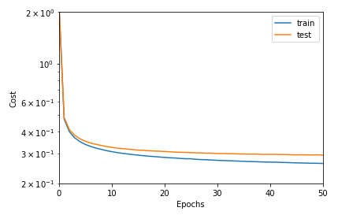
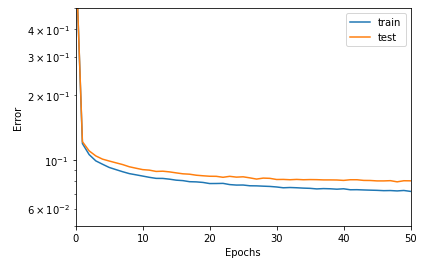

* Epochs = 100

We can see that the model converges with few epochs, 50 epochs are enough to make the model converge. 

From about 20 epochs the cost and error of the test set does not go down anymore.

### Batch size variation [learning_rate=0.1, epochs=50]
 
* Batch size = 64
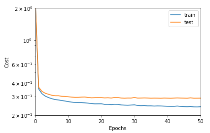
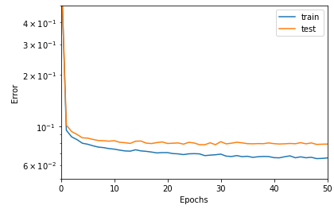

* Batch size = 128
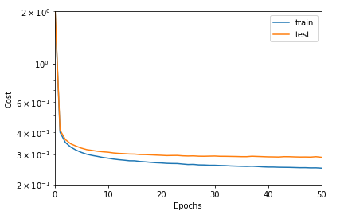
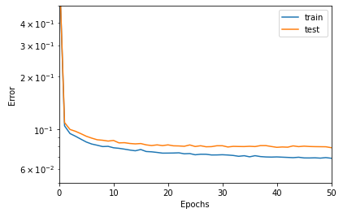

* Batch size = 256

Batch size does not seem to show a significant influence on the cost and error of the model