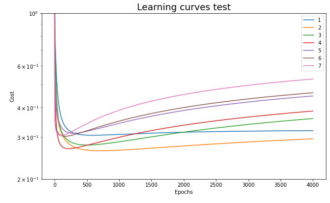

# PW04 - T-DeLearn
* Capocasale Romain
* Demeusy Jean

## Exercise 1
### Dataset 1
**Train/Test error for each polynominal order**

* It can be seen that the polynomial of degree 1 has a fairly high error. The model is underfit. 
* The error goes back down for the degree 2 and 3. 
* Then the error goes back up for the polynomials of degree greater than 3. These models overfit 
* We can see that the optimal degrees for the polynomial is degree **2 or 3**, it is at these points that the error of the train and the test set is the lowest.

**Learning Rate Train**

Naturally we see that as the degree of the polynomial increases, the training error decreases. This is because the higher the degree the more the polynomial adapts to the training data and overfit

**Learning Rate Test**

Here, the same observations can be made as on the error graph. We can see that from degree 3, the cost starts to increase and that the model overfits. This graph allows to confirm that the best degree of the polynomial are 2 and 3 in term of cost

### Dataset 2
**Train/Test error for each polynominal order**

The same comments apply for this dataset. However this time it is clear that the polynomial of degree **2** is the one with the smallest error.

**Learning Rate Train**

The same remarks apply for this dataset.

**Learning Rate Test**

Polynomials of degree 2, 3 and 4 have the lowest cost. We can see that from these 3 graphs the polynomial of degree **2** seems to be the best solution.