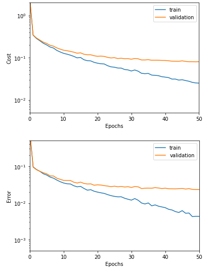
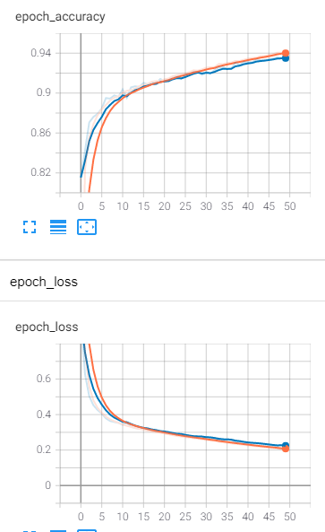

# T-DeLearn - PW05
* Capocasale Romain
* Demeusy Jean
* 27.03.2021

## Exercise 3
### Shallow Network : Single hidden layer layer with 150 units
**Batch size = 256, Learning rate = 0.1, Epoch = 50**
test error = 0.038857142857142854

**Batch size = 256, Learning rate = 0.1, Epoch = 100**
test error = 0.03076190476190476

We can see that as the number of epochs increases, the model tends to overfits.

**Batch size = 64, Learning rate = 0.1, Epoch = 50**
test error = 0.025333333333333333

By decreasing the batch size the model seems to overfits.

**Batch size = 64, Learning rate = 0.05, Epoch = 100**
test error = 0.023809523809523808

### Deeper Network : Three hidden layers with 250, 150, 50 hidden layers
**Batch size = 256, Learning rate = 0.5, Epoch = 50**
test error = 0.023714285714285716

With this configuration we see that the model overfit. The validation curve separates from the training curve.

**Batch size = 64, Learning rate = 0.5, Epoch = 50**
test error = 0.02038095238095238

With this configuration we see that the model overfit. The validation curve separates from the training curve.

**Batch size = 256, Learning rate = 0.5, Epoch = 100**
test error = 0.021142857142857144

Once again we see that the model overfits.

**Batch size = 256, Learning rate = 0.1, Epoch = 50**
test error = 0.03942857142857143

This time we see that the model does not overfit. For our neural network architecture with 3 hidden layers, these parameters seem the best
### Conclusion
It can be seen that the 3 hidden layer model overfits more than the 1 hidden layer model. This is because the architecture of the model is too complex and it has too many parameters. We can also see that the more the model overfits the lower the test errors. So we have to find a compromise for the model between low test error and low overfitting. Compared to the experiment above, the model which seems to respect this compromise the best is: **The model with one hidden layer with Batch size = 256, Learning rate = 0.1, Epoch = 100**

It is this model which will be selected.

## Exercise 4
With the model with one hidden layer with Batch size = 256, Learning rate = 0.1, Epoch = 100 the following result are obtained : 
* Categorical Crossentropy Error : 0.1632261723279953

We can see that the loss graph has a similar shape to the version without Keras. We also see that for the same model Keras has a smaller error than the same model without Keras.

We can see below the accuracy and loss plot on tensorboard:
