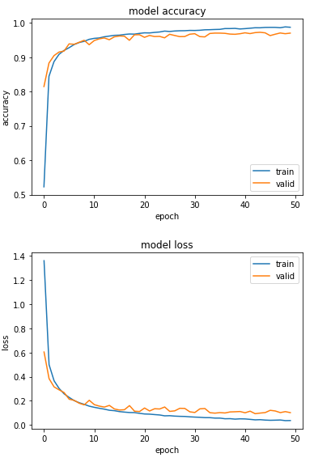
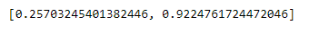
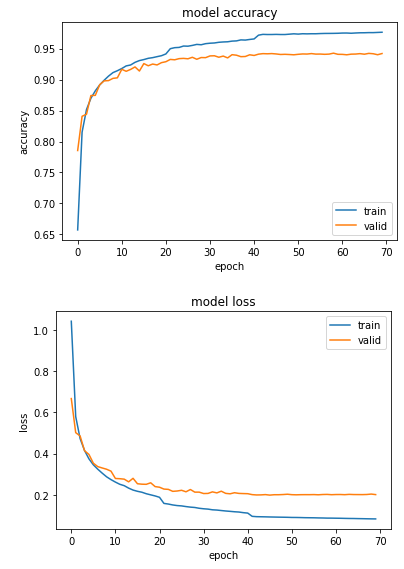
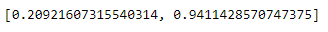

# Report
* Capocasale Romain
* Demeusy Jean

## Point B
Initialisation Glorot :
```python
initializer = tf.keras.initializers.GlorotNormal()
```

## Point C
Initialisation with random distribution of param (0,1) :
```python
initializer = tf.keras.initializers.RandomNormal(mean=0.0, stddev=1.0)
```

## Point D
Here is the baseline score obtained from the model with : 
* 3 hidden layers (150 units, 100 units, 50 units)
* Initialization of weights with GlorotNormal 
* Batch size of 16
* Learning rate of 0.1
* 20 epochs



Score with droupout :
...
## Point E
code : 
```python
# Learning rate scheduler
def scheduler(epoch, lr):
    if epoch >= 0 and epoch <= 20:
        return 0.1
    elif epoch >= 21 and epoch <= 40:
        return 0.05
    elif epoch >= 41 and epoch <=70:
        return 0.01
    else:
        return lr

scheduler = tf.keras.callbacks.LearningRateScheduler(scheduler)
```

Score with scheduler :


Compared to the baseline we can see that the accuracy increases slightly and that the model starts to overfit from 20 epochs. It is therefore interesting to keep the result of the baseline with 20 epochs which does not overfit.