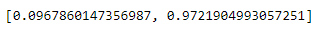

# T-DeLearn - PW06

* Capocasale Romain
* Demeusy Jean
* 01.04.2021

## Point B

Initialisation Glorot :
```python
initializer = tf.keras.initializers.GlorotNormal()
```


It seams that the training does quite well, weights and biases for all three layers are modified in time, without apparent saturation.

## Point C

Initialisation with random distribution of param (0,1) :
```python
initializer = tf.keras.initializers.RandomNormal(mean=0.0, stddev=1.0)
```


It seams that the first layer (named "dense") has only learned the bias, and not the weight yet. The second layer (named "dense_1") has learned a bit more on the weight taht the first layer, but still the evolution of the activation is subtle.

## Point D

Here is the baseline score obtained from the model with : 
* 3 hidden layers (150 units, 100 units, 50 units)
* Initialization of weights with GlorotNormal 
* Batch size of 16
* Learning rate of 0.1
* 50 epochs



We add a Dropout layer after each Dense layer (execpet the last) with the following line : 

```python
layers.append(tf.keras.layers.Dropout(0.5))
```

Score with droupout :


In this case there is not necessarily an improvement on the baseline. The scores obtained for the baseline are already very high and it is difficult to beat them. In this case, the dropout does not improve the results.

## Point E

code : 
```python
# Learning rate scheduler
def scheduler(epoch, lr):
    if epoch >= 0 and epoch <= 20:
        return 0.1
    elif epoch >= 21 and epoch <= 40:
        return 0.05
    elif epoch >= 41 and epoch <=70:
        return 0.01
    else:
        return lr

scheduler = tf.keras.callbacks.LearningRateScheduler(scheduler)
```

Score with scheduler :


Compared to the baseline we can see that the accuracy increases slightly and that the model starts to overfit from 20 epochs. It is therefore interesting to keep the result of the baseline with 20 epochs which does not overfit.