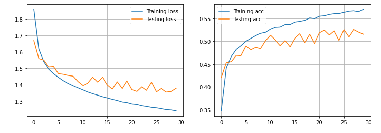
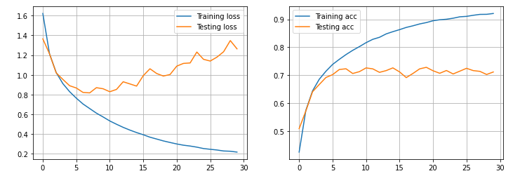
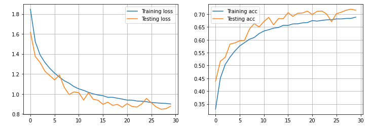
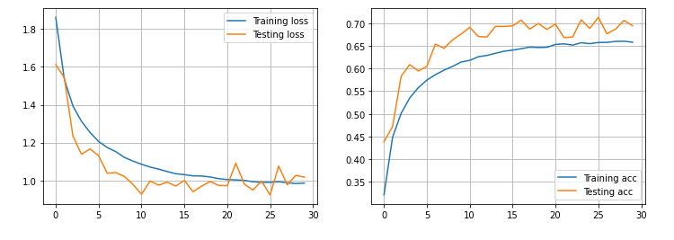
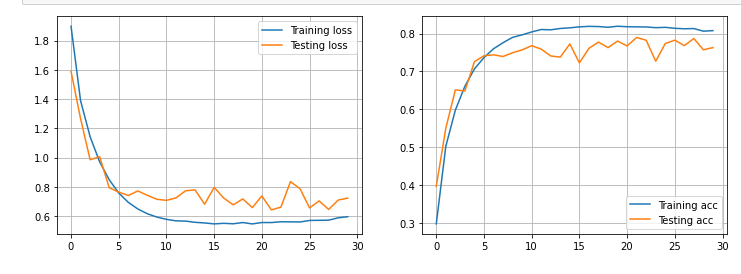

# Report - DeepL PW08
* Romain Capocasale
* Jean Demeusy
* 29.04.2021

## Exercice 1

a) 

With S = 1 and P = 1, the output is the same dimension as the input. The padding requiered to get the same size is P = (size(weights)-1) / 2 = (3-1)/2 = 1.

b)

## Exercice 2

### One-layer network and weight visualisation
| Dense | Architecture                                                                                                                       | Acc. train % | Acc. test% |
|-----|------------------------------------------------------------------------------------------------------------------------------------|--------------|------------|
| 1   | Layer1: DENSE 10 neurons, activation = "softmax", l2 regularization   | 33.3 | 33.7 |

Loss/acc plot:

Weights visualisation

### Two-layers network
| Dense | Architecture                                                                                                                       | Acc. train % | Acc. test% |
|-----|------------------------------------------------------------------------------------------------------------------------------------|--------------|------------|
| 1   | Layer1: DENSE 128 neurons, activation = "relu"; Layer2: DENSE 10 neurons, activation = "softmax". batch size: 128   | 45.5 | 44.2 |

Loss/acc plot:

| Dense | Architecture                                                                                                                       | Acc. train % | Acc. test% |
|-----|------------------------------------------------------------------------------------------------------------------------------------|--------------|------------|
| BEST   | Layer1: DENSE 128 neurons, activation = "relu"; Layer2: DENSE 32 neurons, activation = "relu";  Layer3: DENSE 10 neurons, activation = "softmax". batch size: 256  | 51.3 | 47.4 |

Loss/acc plot:

## Exercice 3
### Simple CNN
| CNN | Architecture                                                                                                                       | Acc. train % | Acc. test% |
|-----|------------------------------------------------------------------------------------------------------------------------------------|--------------|------------|
| 1   | Layer1 : CONV D=32, w=h=3, S=1, P='same', activation='relu;  Layer2 : MAXPOOL S=1, size=2; Layer3 : DENSE 10, activation='softmax' |     57.0     |    51.5    |

Loss/acc plot:

Discussion from previous exercice : 

We can see that the model based on CNN is way more accurate than the previous MLP model : the accuracy with CNN layers is around 6% higher than the Dense network. This seams logical, as the type of layer used here is coherent with the type of data passing through the network (images). CNN layers allows to keep spatial information in the image, where MLP flatten all dimensions to a single vector for each image.

### Deeper CNN
| CNN | Architecture                                                                                                                       | Acc. train % | Acc. test% |
|-----|------------------------------------------------------------------------------------------------------------------------------------|--------------|------------|
| 1   | Layer1 : CONV D=32, w=h=3, S=1, P='same', activation='relu;  Layer2 : CONV D=32, w=h=3, S=1, P='same', activation='relu; Layer3 : MAXPOOL S=1, size=2; Layer4 : DROPOUT : 0.25; Layer4 : CONV D=64, w=h=3, S=1, P='same', activation='relu; Layer5 : DENSE 10, activation='softmax'|     92.0     |    71.1    |
| 2   | Layer1 : CONV D=32, w=h=3, S=1, P='same', activation='relu;  Layer2 : CONV D=32, w=h=3, S=1, P='same', activation='relu; Layer3 : MAXPOOL S=1, size=2; Layer4 : DROPOUT : 0.5; Layer5 : CONV D=32, w=h=3, S=1, P='same', activation='relu; Laye6 : DROPOUT : 0.5; Layer7 : DENSE 10, activation='softmax'|     68.9    |    71.5    |
| 3   | Layer1 : CONV D=32, w=h=3, S=1, P='same', activation='relu;  Layer2 : CONV D=32, w=h=3, S=1, P='same', activation='relu; Layer3 : MAXPOOL S=1, size=2; Layer4 : DROPOUT : 0.5; Layer5 : CONV D=32, w=h=3, S=1, P='same', activation='relu; Laye6 : DROPOUT : 0.5; Layer7 : DENSE 128, activation='relu'; Layer8 : DROPOUT ; Layer9 : DENSE 10, activation='softmax'|     65.80    |    69.4    |
| 4   | LLayer1 : CONV D=32, w=h=3, S=1, P='same', activation='relu; Layer2 : DROPOUT 0.2;Layer3 : CONV D=32, w=h=3, S=1, P='same', activation='relu; Layer4 : MAXPOOL S=1, size=2;Layer5 : CONV D=64, w=h=3, S=1, P='same', activation='relu; Layer6 : DROPOUT 0.2;Layer7 : CONV D=64, w=h=3, S=1, P='same', activation='relu; Layer8 : MAXPOOL S=1, size=2;Layer9 : CONV D=128, w=h=3, S=1, P='same', activation='relu; Layer10 : DROPOUT 0.2;Layer11 : CONV D=128, w=h=3, S=1, P='same', activation='relu; Layer12 : MAXPOOL S=1, size=2;Layer13 : DROPOUT 0.2;Layer14 : Dense 1024, activation='relu'Layer15 : DROPOUT 0.2;Layer16 : Dense 512, activation='relu'Layer17 : DROPOUT 0.2;Layer18 : Dense 10, activation='softmax'|     80.8    |    76.3    |

CNN 1 Loss/acc plot:

CNN 2 Loss/acc plot:

CNN 3 Loss/acc plot:

CNN 4 Loss/acc plot:

Discussion : 
It can be seen that the best result is obtained with the 4th CNN architecture. This architecture has more Convolution/Maxpooling layer and with more filter on the convolution layer. This configuration also has 2 Dense layers (one of 1024 and one of 512) compared to the others. We also notice that this configuration does not overfit the data (compared to the first configuration for example). This is the 4th configuration with an accuracy of 76.3 on the test set which is retained.
