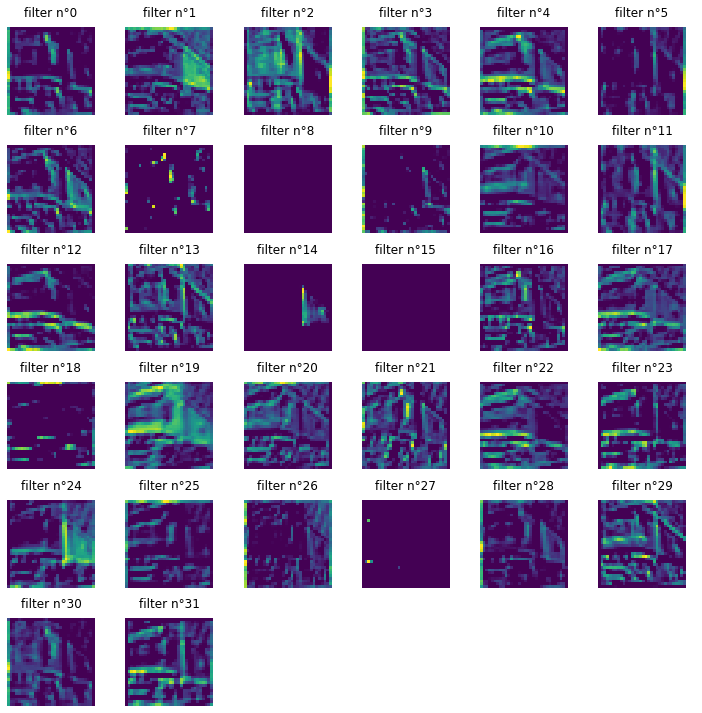

# Report - DeepL PW09
* Romain Capocasale
* Jean Demeusy
* 06.05.2021

## Exercise 1

Description of data augmentation (DA) strategies :

| DA | Parameters |
|-----|--------------------------|
|  No DA | - |
|  DA v1 | rotation_range=10, shear_range=0.08, width_shift_range=0.08, height_shift_range=0.08, zoom_range=0.08 |
|  DA v2 | rotation_range=20, shear_range=0.10, width_shift_range=0.10, height_shift_range=0.10, zoom_range=0.10 | 
| DA v3 | rotation_range=30, shear_range=0.15, width_shift_range=0.15, height_shift_range=0.15, zoom_range=0.20 |
| DA v4 | rotation_range=05, shear_range=0.05, width_shift_range=0.05, height_shift_range=0.05, zoom_range=0.05 |

| CNN | Architecture description | Acc. train | Acc. test |
|-----|--------------------------|------------|-----------|
|  No DA | CONV(32F,same)-RELU-CONV(32F,same)-RELU-MAXP(2)-CONV(32F,same)-RELU-MAXP(2)-DENSE | 0.848  | 0.717 |
|  With DA v1 | CONV(32F,same)-RELU-CONV(32F,same)-RELU-MAXP(2)-CONV(32F,same)-RELU-MAXP(2)-DENSE | 0.708  | 0.702 |
|  With DA v2 | CONV(32F,same)-RELU-CONV(32F,same)-RELU-MAXP(2)-CONV(32F,same)-RELU-MAXP(2)-DENSE | 0.720  | 0.700 |
| With DA v3 | CONV(32F,same)-RELU-CONV(32F,same)-RELU-MAXP(2)-CONV(32F,same)-RELU-MAXP(2)-DENSE | 0.654 | 0.632 |
| With DA v4 | CONV(32F,same)-RELU-CONV(32F,same)-RELU-MAXP(2)-CONV(32F,same)-RELU-MAXP(2)-DENSE | 0.776| 0.733 |

a) We can see through the data augmentations strategies that the accuracy doesn't necessarily increase the model accuracy. Even more, with the DA v3 (the one with the highest data augmentation hyper parameters) the accuracy is significatly lower than without DA. Nevertheless, we can see the purpose of DA on the loss graphs.

### No DA: 

### DA v4:

### DA v1:

### DA v2:

### DA v3:

b) When parameters of the DA increase, the difference between training and testing loss decrease. This is mainly what DA is usefull for: reduce overfitting.
When we take a look on the accuracy graphs, we can also see that testing accuracy is less and less oscillation, as the DA parameters increase.

c) If the main goal of the model is to have a high accuracy, than the DA v4 is the best strategy. If the goal is to reduce overfitting, DA v1 seams to be better, because the accuracy curves are following each other well in this strategy.

## Exercise 2

Here is what we've got as activation for a given image of the set :
Sample image :

### First Conv2D layer activations :

This layer seams to detect spatial object on the image, such as vertical lignes, horizontal lines, curves, uniform regions, etc. 

### First Relu layer activations :

This layer takes the previous activation as input, and apply a "ReLu" activation. Then it should look a lot alike the previous filters, but with higher contrast. It is in fact the case, quite uniform image in the previous layer are monochromatic in this layer, and detected objects are brightened in this layer.

### First MaxPooling2D activations :

This layer create a more pixelated image than the one used as input. For each (2x2) pixels, it takes only the highest value, and then move to the next (2x2) pixels. We can in deed see that the image is way more pixelated than before.

## Exercise 4
The main changes in this network compared to the previous one are 
1. simplification of the model architecture and reduction of complexity.
2. Use of more Inceptions models
3. Addition of Stem layer before Inception blocks (Set of operations performed with Inception blocks)
4. Using Reduction Blocks which are used to change the width and height of the grid.