# T-DeLearn PW10
* Romain Capocasale
* Jean Demeusy

## Exercice 1
### A
Summary of sequential architecture : 
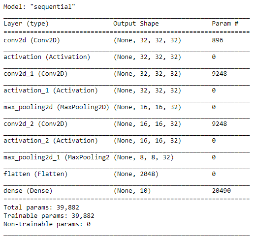

Score of sequential : 
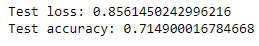

Summary of functional architecture : 
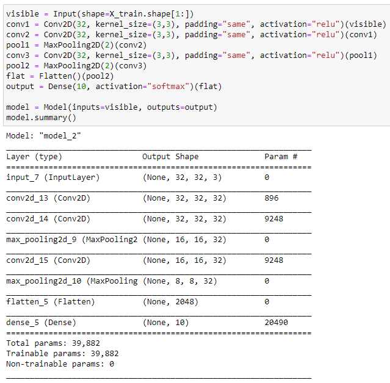

Score of functional : 
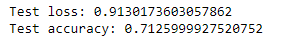

We can can that, the two model have the same number of parameters and the scores is slightly almost similar.

### B
| Model | Architecture description | Acc. train | Acc. test |
|-----|--------------------------|------------|-----------|
|  1 - multiple path| BRANCH1:CONV(D=32, w=h=3, S=1, P=same, act=relu)-DROPOUT(0.2)-MAXPOOL(S=1, size=2)-FLATTEN; BRANCH2:CONV(D=32, w=h=6, S=1, P=same, act=relu)-DROPOUT(0.2)-MAXPOOL(S=1, size=2)-FLATTEN; CONCAT(BRANCH1, BRANCH2); DENSE(100, act=relu); DENSE(10, softmax)  | 0.9020 | 0.6517 |
|  2 - multiple features| BRANCH1:CONV(D=32, w=h=3, S=1, P=same, act=relu)-DROPOUT(0.2)-MAXPOOL(S=1, size=2)-FLATTEN; BRANCH2(BRANCH1):CONV(D=32, w=h=3, S=1, P=same, act=relu)-DROPOUT(0.2)-MAXPOOL(S=1, size=2)-FLATTEN; BRANCH3(BRANCH2):CONV(D=32, w=h=3, S=1, P=same, act=relu)-DROPOUT(0.2)-MAXPOOL(S=1, size=2)-FLATTEN; CONCAT(BRANCH1, BRANCH2, BRANCH3); DENSE(100, act=relu); DENSE(10, softmax)  | 0.8658 | 0.6945 |
|  3 - multiple features| BRANCH1:CONV(D=32, w=h=3, S=1, P=same, act=relu)-DROPOUT(0.2)-MAXPOOL(S=1, size=2)-FLATTEN; BRANCH2(BRANCH1):CONV(D=32, w=h=3, S=1, P=same, act=relu)-DROPOUT(0.2)-MAXPOOL(S=1, size=2)-FLATTEN; BRANCH3(BRANCH2):CONV(D=32, w=h=3, S=1, P=same, act=relu)-DROPOUT(0.2)-MAXPOOL(S=1, size=2)-FLATTEN; CONCAT(BRANCH1, BRANCH2, BRANCH3); DENSE(64, act=relu); DROPOUT(0.2); DENSE(10, softmax)  | 0.8216 | 0.7153 |
  4 - multiple path| BRANCH1:CONV(D=32, w=h=3, S=1, P=same, act=relu)-DROPOUT(0.2)-MAXPOOL(S=1, size=2)-CONV(D=64, w=h=3, S=1, P=same, act=relu)-DROPOUT(0.2)-MAXPOOL(S=1, size=2)-FLATTEN; BRANCH2(BRANCH1):CONV(D=32, w=h=3, S=1, P=same, act=relu)-DROPOUT(0.2)-MAXPOOL(S=1, size=2)-CONV(D=64, w=h=6, S=1, P=same, act=relu)-DROPOUT(0.2)-MAXPOOL(S=1, size=2)-FLATTEN;  CONCAT(BRANCH1, BRANCH2); DENSE(50, act=relu); DROPOUT(0.2); DENSE(10, softmax)  | 0.6765 | 0.6891 |

Model 1 Loss/Accs : 
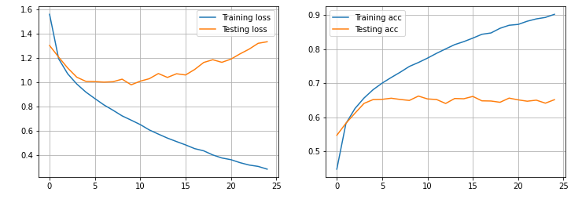

Model 2 Loss/Accs : 
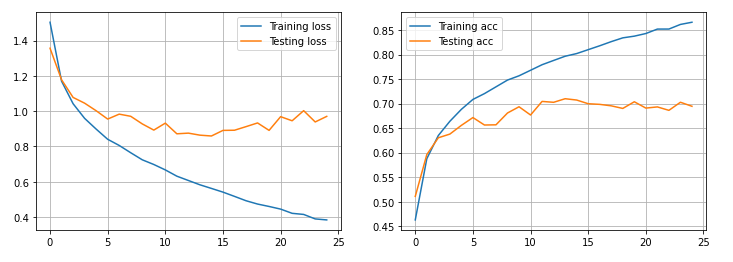

Model 3 Loss/Accs : 
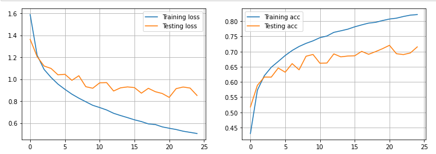

Model 4 Loss/Accs : 
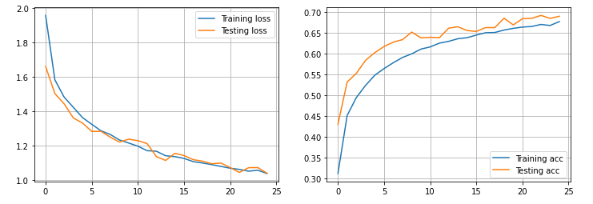

### Discussion 
It can be seen that the model with the best accuracy is model number 3 with multiple features. We also see that the first 3 models overfit, this problem can be avoided by using data augmentation which has not been implemented. The 4th model overfits the least and seems the most stable.

We notice with this lab and the 2 previous ones that the accuracy of the models is around 0.70% and cannot be significantly exceeded despite all attempts.

## Exercice 2
The base model chosen is MobileNet.

### Architecture 1
Hyperparameters:
* Learning Rate : 0.001
* Batch Size = 128
* Epoch = 20

 Model | Architecture description | Acc. train | Acc. test |
|-----|--------------------------|------------|-----------|
|  1 | MobileNet - Flatten - Dropout(0.5) - Dense(20)  | 0.94 | 0.68 |

Loss architecure 1:
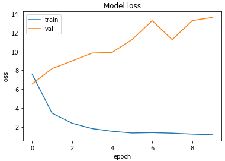

Accuracy architecture 1:
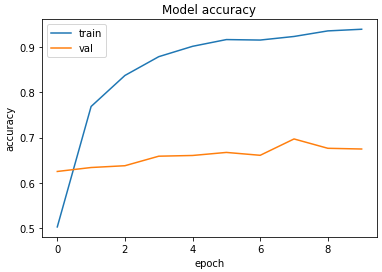

We can see that despite the performance of the model, it overfits a lot and will not be retained for the fine-tuning phase.

### Architecture 2
Hyperparameters:
* Learning Rate : 0.001
* Batch Size = 128
* Epoch = 20

 Model | Architecture description | Acc. train | Acc. test |
|-----|--------------------------|------------|-----------|
|  2 | MobileNet - Flatten - Dropout(0.5) - Dense(32)  - Dropout(0.5) - Dense(20) |  |  |

Loss architecure 2:
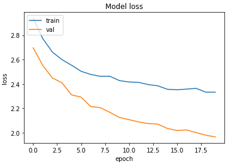

Accuracy architecture 2:
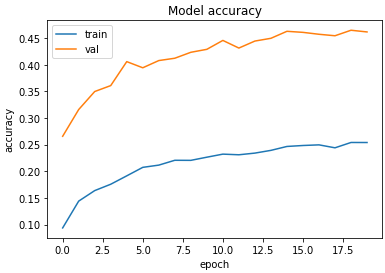

Hyperparameters fine tuning:
* Learning Rate : 0.00000001
* Batch Size = 128
* Epoch = 20

Loss fine-tuning architecure 2:
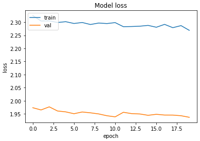

Accuracy fine-tuning architecture 2:
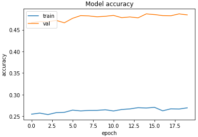

### Discussion
We can see that despite the fact that the first architecture gives better results it overfits a lot. The second architecture gives less good results but overfits less. This second model is therefore more stable and has been retained to perform the finetuning. 
We can see that the finetuning has only slightly improved the score of the model. The accuracy has gone from about **0.4614** to **0.4845**.