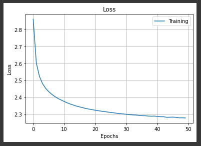
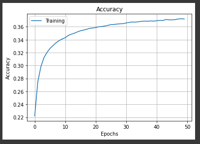

# Practical Work 11
* Capocasale Romain
* Demeusy Jean

# Exercice 3
## Experience 1
* Hyperparmeters :
    * **RNN number of cells :** 64
    * **Number of epochs :** 50
    * **Batch size :** 128

**Loss**

**Accuracy**

## Experience 2
* Hyperparmeters :
    * **RNN number of cells :** 128
    * **Number of epochs :** 50
    * **Batch size :** 256

**Loss**

**Accuracy**

## Generated Startup name
| Seed  | Size | Result  |
|---|---|---|
| Coin  | 20  |  Stales, Inc. HonoFir |
| Sport  | 20  |  ono Contach Cayscope |
| Bank  | 20  |  ngion StregesyX Sour |
| Computer | 15 |MealGaz Mossto |
|Analysis|15|ecip Catleridea|
| energy | 15 | a Prisofe CrePi |
| innovation | 12 | deak Adinizo |
| medical | 12 | Virided 3De |
| money | 12 | Seepo Souph |

## Comment
We can see that experiment 2 obtains better results than experiment 1. The loss is lower and the accuracy higher. The model of the 2nd experiment is used to create the startup names. With experiment 2, the accuracy exceeded 0.40.

For the stratup names we can see that for most of the cases the capital letters at the beginning of the words are well respected. Some names are realistic as for example : 
* Stales, Inc. HonoFir
* MealGaz Mossto
* Virided 3De
* Seepo Souph

Other names are less realistic like : 
* ono Contach Cayscope
* ngion StregesyX Sour
* a Prisofe CrePi

